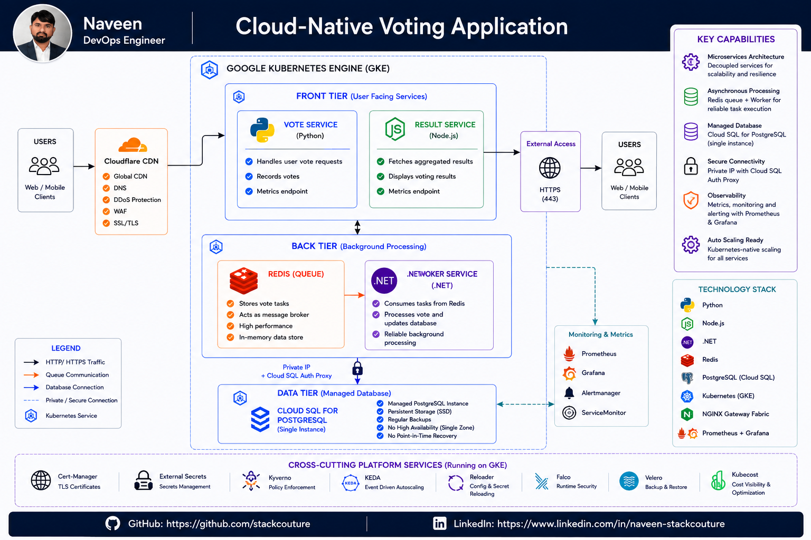

## Cloud-Native Voting Application

> **A production-inspired polyglot microservices application showcasing Kubernetes, GitOps, CI/CD, progressive delivery, and cloud-native deployment practices on Google Kubernetes Engine (GKE).**

<p align="center">


</p>

---
## Architecture 

<p align="left">
  
</p>

---
### Highlights

* **Python**, **Node.js**, and **.NET** microservices
* Asynchronous messaging with **Redis**
* Persistent storage with **Cloud SQL for PostgreSQL**
* Containerized using **Docker**
* CI with **GitHub Actions**
* Container security using **Trivy** and **Cosign**
* GitOps deployment to **Google Kubernetes Engine (GKE)** using **Argo CD**
* Progressive delivery with **Argo Rollouts**

---
## Table of Contents

- [Cloud-Native Voting Application](#cloud-native-voting-application)
- [Highlights](#highlights)
- [Project Overview](#project-overview)
- [Application Capabilities](#application-capabilities)
- [Architecture](#architecture)
- [Key Features](#key-features)
- [Demo](#demo)
- [Repository Structure](#repository-structure)
- [Documentation](#documentation)
- [Contributing](#contributing)
  - [How to Contribute](#how-to-contribute)
  - [Contribution Guidelines](#contribution-guidelines)
  - [Reporting Issues](#reporting-issues)
  - [Questions](#questions)
- [Acknowledgements](#acknowledgements)
  - [Original Project](#original-project)
  - [Technologies Used](#technologies-used)
- [License](#license)

---
## Project Overview

This repository contains a **polyglot cloud-native voting application** built with **Python**, **Node.js**, **.NET**, **Redis**, and **PostgreSQL**. It demonstrates a microservices-based architecture that uses asynchronous message processing, enabling services to scale and evolve independently.

The application is designed to showcase modern Kubernetes deployment patterns and serves as the workload deployed on the production-inspired platform. It is continuously integrated with **GitHub Actions**, containerized with **Docker**, secured through **Trivy** and **Cosign**, and deployed to **Google Kubernetes Engine (GKE)** using a **GitOps** workflow.

---
## Application Capabilities

| Area                     | Implementation                    |
| ------------------------ | --------------------------------- |
| Application Architecture | Polyglot Microservices            |
| Frontend                 | Python (Flask), Node.js (Express) |
| Background Processing    | .NET Worker Service               |
| Message Broker           | Redis                             |
| Database                 | Cloud SQL for PostgreSQL          |
| Containerization         | Docker                            |
| Continuous Integration   | GitHub Actions                    |
| Container Registry       | Google Artifact Registry          |
| Image Security           | Trivy, Cosign                     |
| Deployment               | Google Kubernetes Engine (GKE)    |
| GitOps                   | Argo CD                           |
| Progressive Delivery     | Argo Rollouts                     |
| Configuration Management | Kustomize                         |

---
## Key Features

* Polyglot microservices application built with **Python (Flask)**, **Node.js (Express)**, and **.NET**
* Asynchronous event-driven architecture using **Redis** as the message broker
* Persistent data storage with **Cloud SQL for PostgreSQL**
* Containerized services using **Docker**
* Automated CI pipelines with **GitHub Actions**
* Container vulnerability scanning using **Trivy**
* Software Bill of Materials (SBOM) generation
* Container image signing using **Cosign**
* GitOps-based deployments with **Argo CD**
* Progressive delivery using **Argo Rollouts**
* Deployment to **Google Kubernetes Engine (GKE)**
* Declarative Kubernetes manifests managed with **Kustomize**

---
## Demo 

<h4>Blue Green Deployment</h4>
<p align="left">
  
</p>

<h4>Canary Deployment</h4>
<p align="left">
  
</p>

---
## Repository Structure

```
voting-app/
├── .github/
│   └── workflows/  # GitHub Actions CI pipelines
        ├──   result-ci.yaml
        ├──   vote-ci.yaml
        └──   worker-ci.yaml           
├── .vscode/                 # Editor settings
├── healthchecks/            # Shell scripts for Redis & Postgres health probes
│   ├── redis.sh
│   └── postgres.sh
├── result/                  # Node.js result frontend
├── seed-data/               # One-shot vote seeder (Docker Compose profile)
├── vote/                    # Python/Flask vote frontend
├── worker/                  # C# worker service
├── architecture.excalidraw.png
├── docker-compose.yml       # Build-from-source compose file (local dev)
├── docker-compose.images.yml# Pre-built images compose file (quick start)
├── docker-stack.yml         # Docker Swarm stack definition
├── MAINTAINERS
└── LICENSE                  # Apache 2.0
```

---
##  Documentation

| Document            | Description                                                                     |
| ------------------- | ------------------------------------------------------------------------------- |
| **ARCHITECTURE.md** | Application architecture and design overview                                    |
| **SERVICES.md**     | Description of each microservice and its responsibilities                       |
| **DEPLOYMENT.md**   | Deploying the application using Docker Compose and Kubernetes                   |
| **CI-CD.md**        | GitHub Actions pipeline, image build, security scanning, and GitOps deployment  |
| **SECURITY.md**     | Container security, SBOM generation, image signing, and security best practices |
| **DEVELOPMENT.md**  | Local development setup, prerequisites, and build instructions                  |

---
## Contributing

Thank you for your interest in contributing to the Cloud-Native Voting Application!

Contributions that improve the project are always welcome. Whether you're fixing a bug, improving documentation, or proposing a new feature, your support is appreciated.

### How to Contribute

1. Fork the repository.

2. Create a feature branch.

   ```bash
   git checkout -b feature/my-feature
   ```

3. Make your changes.

4. Test your changes locally.

5. Commit your changes with a descriptive commit message.

   ```bash
   git commit -m "feat: add new feature"
   ```

6. Push your branch.

   ```bash
   git push origin feature/my-feature
   ```

7. Open a Pull Request describing your changes.

### Contribution Guidelines

* Follow the existing project structure and coding style.
* Keep changes focused and well documented.
* Test changes before submitting a Pull Request.
* Update documentation when introducing new functionality.
* Use clear and meaningful commit messages.

### Reporting Issues

If you discover a bug or have a feature request, please open a GitHub Issue with:

* A clear description of the problem
* Steps to reproduce (if applicable)
* Expected and actual behavior
* Relevant logs or screenshots

### Questions

If you have questions about the project or its implementation, feel free to open a GitHub Discussion or Issue.

Thank you for contributing! 🚀

---
## Acknowledgements

This project is based on the **Docker Example Voting App**, which provides a simple polyglot microservices application demonstrating asynchronous message processing.

The application has been significantly extended to showcase modern cloud-native application delivery practices, including containerization, CI/CD, GitOps, progressive delivery, and software supply chain security.

### Original Project

* **Docker Example Voting App**
* Repository: https://github.com/dockersamples/example-voting-app
* License: Apache License 2.0

### Technologies Used

This project leverages several open-source technologies, including:

* Docker
* Kubernetes
* Google Kubernetes Engine (GKE)
* GitHub Actions
* Argo CD
* Argo Rollouts
* Redis
* PostgreSQL
* Trivy
* Cosign
* Kustomize

A big thank you to the maintainers and contributors of these open-source projects for making cloud-native application development and deployment possible.

---
## License

[Apache 2.0](./LICENSE)

---