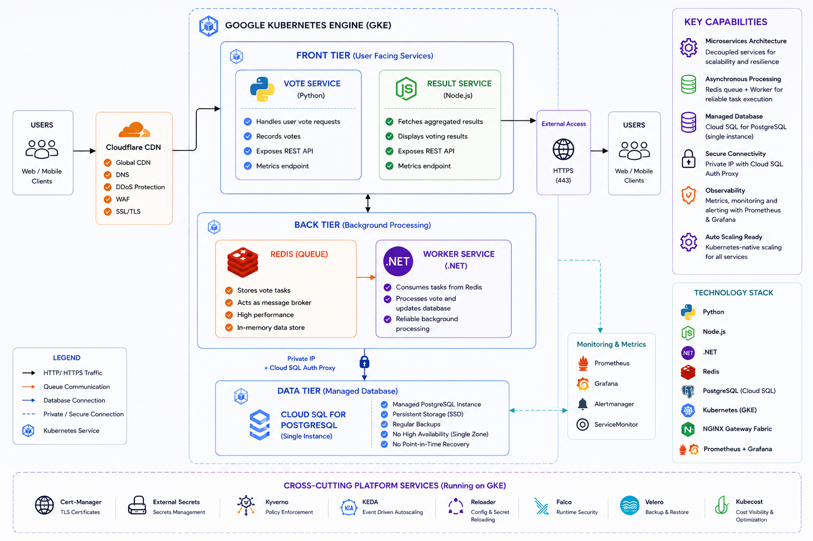
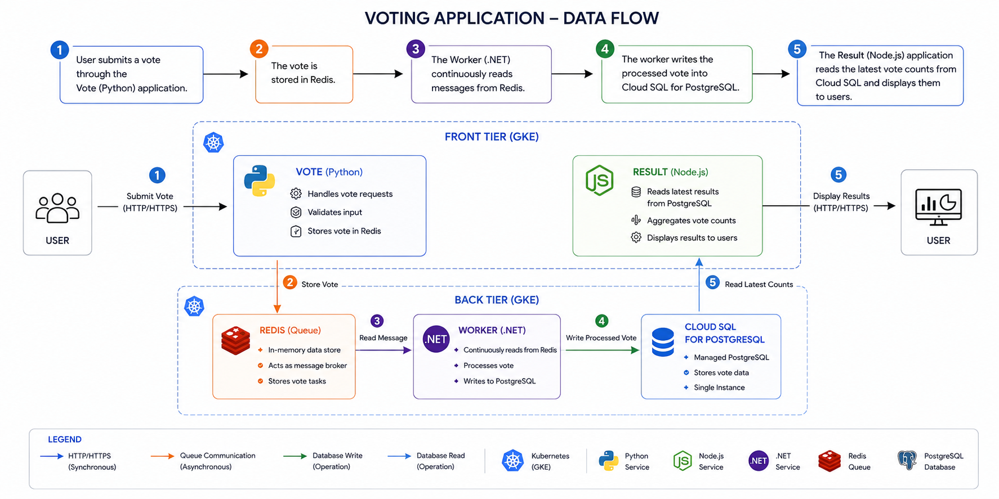

# voting-app
A production-ready polyglot microservices application demonstrating modern GitOps-based platform engineering practices on Google Cloud Platform (GCP). The platform showcases secure CI/CD, Kubernetes-native deployments, Infrastructure as Code (Terraform), continuous reconciliation with ArgoCD, and supply chain security using Trivy, SBOM, and Cosign.


---

## Table of Contents

- [Architecture](#architecture)
- [Services](#services)
- [Repository Structure](#repository-structure)
- [Prerequisites](#prerequisites)
- [End-to-End GitOps Deployment Architecture](#end-to-end-deployment-flow)
- [Acknowledgements](#acknowledgements)
- [License](#license)

---

## Architecture

The application follows a distributed microservices architecture deployed on Google Kubernetes Engine (GKE). Stateless frontend services communicate through Redis for asynchronous processing, while Cloud SQL for PostgreSQL provides managed persistent storage. The platform is designed to demonstrate production-grade deployment patterns, security controls, and GitOps workflows.





---
## Services

| Service    | Language            | Port (host) |   Description                                    |
|------------|---------------------|-------------|----------------------------------------------------|
| `vote`     | Python (Flask)      | `8080`      | Web UI for casting votes                         |
| `result`   | Node.js (Express)   | `8081`      | Web UI for viewing real-time results             |
| `worker`   | C# (.NET)           |  —          | Consumes vote events from Redis and persists processed results to Cloud SQL for PostgreSQL.         |
| `redis`    | `redis:alpine`      |  —          | In-memory message queue for incoming votes        |
| `cloudsql` | `Google Cloud SQL for PostgreSQL`       | `5432`           | Managed PostgreSQL database providing highly available persistent storage for application data.    |

### Network Architecture

For local development, Docker Compose uses two isolated bridge networks:

- front-tier – Browser-facing services
- back-tier – Internal service communication

In production, Kubernetes Services provide service discovery and internal networking, while Cloud SQL is accessed through a private connection using Cloud SQL Auth Proxy or Private IP.

---

## Repository Structure

```
voting-app/
├── .github/
│   └── workflows/  # GitHub Actions CI pipelines
        ├──   result-ci.yaml
        ├──   vote-ci.yaml
        └──   worker-ci.yaml           
├── .vscode/                 # Editor settings
├── healthchecks/            # Shell scripts for Redis & Postgres health probes
│   ├── redis.sh
│   └── postgres.sh
├── result/                  # Node.js result frontend
├── seed-data/               # One-shot vote seeder (Docker Compose profile)
├── vote/                    # Python/Flask vote frontend
├── worker/                  # C# worker service
├── architecture.excalidraw.png
├── docker-compose.yml       # Build-from-source compose file (local dev)
├── docker-compose.images.yml# Pre-built images compose file (quick start)
├── docker-stack.yml         # Docker Swarm stack definition
├── MAINTAINERS
└── LICENSE                  # Apache 2.0
```
---

## End-to-End GitOps Deployment Architecture 
The platform implements a production-ready GitOps continuous delivery model using **GitHub Actions**, **Google Artifact Registry**, **Kustomize**, **ArgoCD**, and **Google Kubernetes Engine**. Every deployment is fully automated, security validated, cryptographically signed, and version controlled. Declarative infrastructure and continuous reconciliation eliminate configuration drift while enabling repeatable, auditable, and reliable application releases

### Table of Contents

- [High-Level Flow](#high-level-flow)
- [Detailed Deployment Workflow](#detailed-deployment-workflow)
  - [1. Developer Pushes Code](#1-developer-pushes-code)
  - [2. GitHub Actions Pipeline Starts](#2-github-actions-pipeline-starts)
  - [3. Unit Testing Stage](#3-unit-testing-stage)
  - [4. Authenticate to Google Cloud](#4-authenticate-to-google-cloud)
  - [5. Docker Image Build](#5-docker-image-build)
  - [6. Vulnerability Scanning with Trivy](#6-vulnerability-scanning-with-trivy)
  - [7. SBOM Generation](#7-sbom-generation)
  - [8. Push Image to Artifact Registry](#8-push-image-to-artifact-registry)
  - [9. Image Signing with Cosign](#9-image-signing-with-cosign)
  - [10. SBOM Attestation](#10-sbom-attestation)
  - [11. GitOps Repository Update](#11-gitops-repository-update)
  - [12. ArgoCD Detects Git Changes](#12-argocd-detects-git-changes)
  - [13. Kubernetes Deployment](#13-kubernetes-deployment)
  - [14. Deployment Completed](#14-deployment-completed)
- [Why This Architecture Matters](#why-this-architecture-matters)
- [Platform Components](#platform-components)
- [Repositories](#repositories)

---
#### High-Level Flow

```text
Developer Commit
       │
       ▼
GitHub Repository
       │
       ▼
GitHub Actions CI
       │
       ├── Source Validation
       ├── Unit Testing
       ├── Container Build
       ├── Vulnerability Scan (Trivy)
       ├── SBOM Generation
       ├── Container Signing (Cosign)
       ▼
Google Artifact Registry
       │
       ▼
GitOps Repository Update
       │
       ▼
ArgoCD Continuous Reconciliation
       │
       ▼
Google Kubernetes Engine (GKE)
       │
       ▼
Application Available to End Users
```

---


#### Acknowledgements

This project is based on Docker's Example Voting App:
https://github.com/dockersamples/example-voting-app

Original project licensed under Apache 2.0.

---

#### Detailed Deployment Workflow

##### 1. Developer Pushes Code

A developer pushes code changes to the application repository:

```bash
git push origin main
```

This triggers the GitHub Actions workflow automatically.

---

##### 2. GitHub Actions Pipeline Starts

The CI pipeline is triggered on:

- Push to `main`
- Pull Requests to `main`

Pipeline stages:

```text
test
   │
   ▼
build-scan-push-sign
   │
   ▼
update-gitops
```

---

##### 3. Unit Testing Stage

The pipeline first validates application quality before any image is built.

**Actions performed:**
- Checkout source code
- Install dependencies
- Run unit tests

```bash
npm ci
npm test
```

**Purpose:**
- Prevent broken code from reaching production
- Ensure application stability
- Catch regressions early

---

##### 4. Authenticate to Google Cloud

GitHub Actions authenticates to GCP using **OIDC + Workload Identity Federation**. No static service account keys are used.

```text
GitHub Actions
        │
        ▼
OIDC Token
        │
        ▼
Workload Identity Pool
        │
        ▼
GCP Service Account
        │
        ▼
Temporary Credentials
```

**Benefits:**
- Eliminates credential leakage
- Improves cloud security
- Enables least-privilege access

---

##### 5. Docker Image Build

The application image is built inside GitHub Actions, tagged with the commit SHA for full traceability:

```bash
docker build -t result:${{ github.sha }} .
```

**Example tag:**

```text
result:a1b2c3d4
```

**Benefits:**
- Immutable deployments
- Full traceability back to the source commit
- Easy rollback by referencing a prior SHA

---

##### 6. Vulnerability Scanning with Trivy

After building the image, **Trivy** scans it for vulnerabilities before it is pushed.

**Scans include:**
- Critical and high severity vulnerabilities
- OS package issues
- Dependency vulnerabilities

**Purpose:**
- Detect insecure packages early
- Shift security left in the pipeline
- Prevent vulnerable images from reaching the registry

---

##### 7. SBOM Generation

The pipeline generates a **Software Bill of Materials (SBOM)** for the image.

**SBOM contains:**
- Installed packages and versions
- Dependencies
- Supply chain metadata

**Format:** `SPDX JSON`

**Purpose:**
- Supply chain transparency
- Compliance and security auditing
- Verifiable record of what's inside the image

---

##### 8. Push Image to Artifact Registry

The scanned and verified image is pushed to **Google Artifact Registry** in `asia-south1`:

```text
asia-south1-docker.pkg.dev/<project>/vote-docker-repo/result:<sha>
```

Artifact Registry acts as the centralised, private image repository for the platform.

---

##### 9. Image Signing with Cosign

The pushed image is cryptographically signed using **Cosign**. The image digest is signed rather than the mutable tag:

```bash
cosign sign result@sha256:<digest>
```

**Purpose:**
- Verify image authenticity at deploy time
- Prevent image tampering
- Improve software supply chain security

---

##### 10. SBOM Attestation

The generated SBOM is attached to the image as a **Cosign attestation**:

```bash
cosign attest result@sha256:<digest>
```

**Benefits:**
- Verifiable, tamper-proof metadata linked to the image
- Trusted software provenance
- Supply chain verification for compliance

---

##### 11. GitOps Repository Update

After the image is pushed and signed, the CI pipeline automatically updates the **GitOps repository** using Kustomize:

```bash
kustomize edit set image result=asia-south1-docker.pkg.dev/...:<github-sha>
```

**Before:**
```yaml
newTag: old-tag
```

**After:**
```yaml
newTag: a1b2c3d4
```

This creates a Git commit in the GitOps repository:

```text
chore(result): update image to a1b2c3d4
```

---

##### 12. ArgoCD Detects Git Changes

ArgoCD continuously watches the GitOps repository. Once the image tag commit lands:

```text
GitOps Repository Updated
            │
            ▼
ArgoCD Detects Drift
            │
            ▼
Sync Operation Starts
```

ArgoCD reconciles the live Kubernetes cluster state with the desired state in Git.

---

##### 13. Kubernetes Deployment

ArgoCD applies the updated manifests to the GKE cluster:

```text
Deployment Updated
       │
       ▼
Rolling Update Initiated
       │
       ▼
New ReplicaSet Created
       │
       ▼
Old Pods Terminated Gracefully
       │
       ▼
Traffic Routed to Healthy Pods
```

Kubernetes pulls the new image directly from Artifact Registry using the node service account credentials.

---

##### 14. Deployment Completed

The new application version is now live inside the cluster. End-to-end summary:

```text
Code Push  ──►  GitHub Actions  ──►  Docker Build
                                          │
                                          ▼
                                    Security Scan
                                          │
                                          ▼
                                   SBOM Generation
                                          │
                                          ▼
                                    Image Signing
                                          │
                                          ▼
                                  Artifact Registry
                                          │
                                          ▼
                                   GitOps Update
                                          │
                                          ▼
                                    ArgoCD Sync
                                          │
                                          ▼
                               Kubernetes Deployment ✓
```
## Why This Architecture Matters

### Architecture Decisions

| Decision                 | Rationale |
|--------------------------|-----------|
| GitHub Actions           | Native GitHub integration with scalable CI automation |
| ArgoCD                   | GitOps continuous reconciliation for Kubernetes |
| Google Artifact Registry | Secure private container registry integrated with IAM |
| Kustomize                | Native Kubernetes manifest customization |
| Terraform                | Declarative Infrastructure as Code provisioning |
| Cloud SQL                | Managed PostgreSQL with automated backups and high availability |
| Redis                    | High-performance in-memory message queue |
| Trivy                    | Container vulnerability scanning |
| Cosign                   | Container signing and provenance verification |

### GitOps Benefits

| Benefit                           | Description                                            |
|-----------------------------------|--------------------------------------------------------|
| Declarative deployments           | Desired state is always defined in Git                 |
| Version-controlled infrastructure | Every change has a commit, author, and timestamp       |
| Easy rollback                     | Revert a Git commit to roll back a deployment          |
| Auditable changes                 | Full history of what changed, when, and why            |
| Reduced configuration drift       | ArgoCD continuously reconciles actual vs desired state |

### Security Benefits

| Benefit                     | Description                                                   |
|-----------------------------|---------------------------------------------------------------|
| No static cloud credentials | OIDC + Workload Identity Federation only                      |
| Signed container images     | Cosign signatures prevent tampered images from running        |
| SBOM attestations           | Verifiable supply chain metadata attached to every image      |
| Vulnerability scanning      | Trivy blocks vulnerable images before they reach the registry |
| Immutable image tags        | SHA-based tags prevent silent image replacement               |

### Operational Benefits

| Benefit                      | Description                                                 |
|------------------------------|-------------------------------------------------------------|
| Fully automated deployments  | Zero manual steps from code push to live deployment         |
| Reproducible infrastructure  | Terraform + GitOps ensures environments are consistent      |
| Safer production releases    | Security gates (scan, sign, attest) run on every change     |
| Faster delivery pipeline     | Automation removes manual review and deployment bottlenecks |
| Reduced manual intervention  | ArgoCD self-heals drift without operator input              |

### Deployment Principles

| Principle                      | Implementation                                            |
|--------------------------------|-----------------------------------------------------------|
| GitOps                         | ArgoCD continuously reconciles Kubernetes state from      |  Git |
| Immutable Artifacts            | Every container image is tagged with the Git commit SHA.  |
| Zero Trust Authentication      | GitHub Actions authenticates to Google Cloud using OIDC Workload Identity Federation.     |
| Supply Chain Security          | Trivy, SBOM generation, Cosign signing, and attestation secure the software supply chain. |
| Infrastructure as Code         | Terraform provisions all cloud infrastructure.            |
| Declarative Configuration      | Kubernetes manifests are managed with Kustomize.          |


### Platform Components

| Component                 | Responsibility                                               |
|---------------------------|--------------------------------------------------------------|
| **GitHub Actions**        | CI/CD automation — build, test, scan, sign, push             |
| **Artifact Registry**     | Centralised private container image storage                  |
| **Trivy**                 | Vulnerability scanning of container images                   |
| **Cosign**                | Cryptographic image signing and SBOM attestation             |
| **Kustomize**             | Kubernetes manifest customisation and image tag updates      |
| **GitOps Repository**     | Single source of truth for desired cluster state             |
| **ArgoCD**                | Continuous Kubernetes reconciliation                         |
| **GKE**                   | Container orchestration platform                             |
| **Terraform**             | Infrastructure provisioning (GKE, IAM, networking, registry) |
| **Cloud SQL**             | Managed PostgreSQL database                                  |
| **Redis**                 | Cache queue                                                  |
| **GitHub**                | Source code management                                       |


### Architecture Summary

This platform demonstrates a production-grade GitOps architecture on Google Cloud Platform. Infrastructure is provisioned using Terraform, applications are continuously integrated through GitHub Actions, secured with Trivy and Cosign, stored in Artifact Registry, and deployed to Google Kubernetes Engine via ArgoCD. Declarative configuration, immutable container images, automated reconciliation, and supply chain security collectively provide a scalable, repeatable, and secure deployment platform.

---
## License

[Apache 2.0](./LICENSE)
